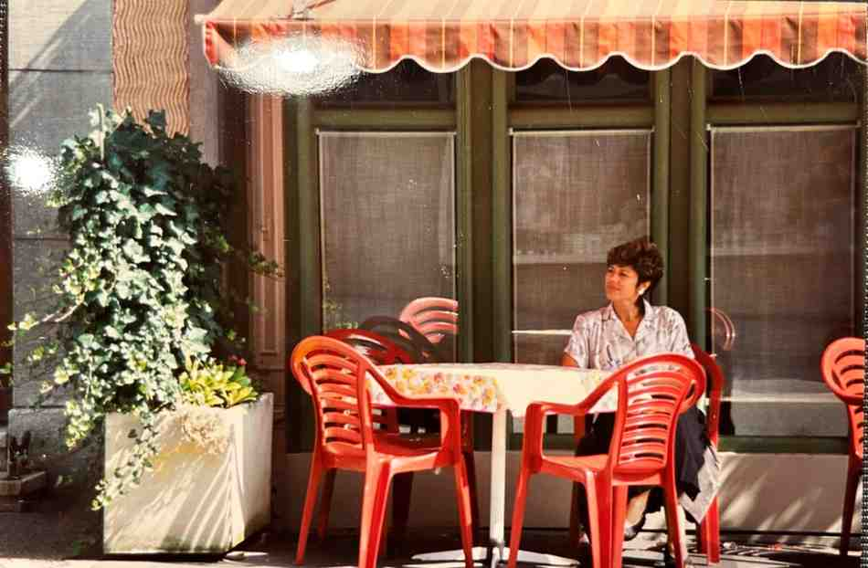
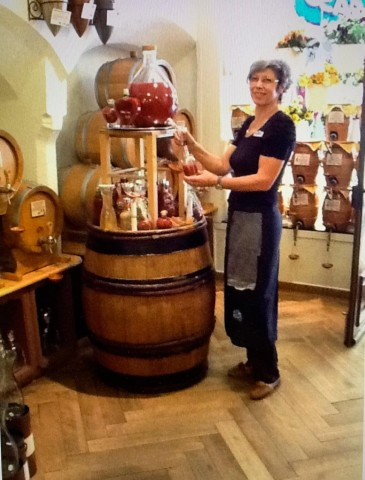
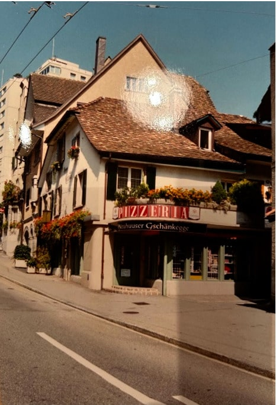

+++
title = "Reportage: Vom Rheinfall an den Wohlensee"
date = "2024-06-12"
draft = false
pinned = false
tags = ["Restaurant", "Pizza"]
image = "viewrecentphotos.jpeg"
description = "Gabi Corra wechselt nach 25 Jahren als Wirtin den Beruf. Sie vollzieht den Schritt von der Selbständigkeit in die Unselbständigkeit und fühlt sich dabei viel freier. \n"
+++
In einer malerischen Stadt, wo die Tradition in jedem Winkel zu spüren ist, findet eine ehemalige Wirtin aus Neuhausen eine neue berufliche Heimat. Nachdem sie ein beliebtes Familienrestaurant über Jahre hinweg erfolgreich geführt hat, wagt sie den Sprung in ein neues Kapitel ihres Lebens: den Verkauf in einem exquisiten Delikatessengeschäft in Bern.



**Firmenaufgaben und Umzüge**

Laut Bundesamt für Statistik(BFS) geben in der Schweiz pro Jahr über 30'000 Firmen ihre Tätigkeit auf. Die Gründe dafür sind vielfältig. Die Binnenwanderung in der Schweiz variiert Schätzungen zufolge zwischen 10 und 15 % der Bevölkerung. Die genannten Ereignisse sind einschneidende Situationen, die tiefgreifende Veränderungen im Leben eines Menschen nach sich ziehen.

 



**Die Anfänge in Neuhausen**

Ich sitze gegenüber von Gabi Corra an einem langen Holztisch, im Hintergrund hängt ein selbst gemaltes Bild vom Restaurant Rebstock. Das Restaurant, das sie von ihren Eltern übernommen hat, ist ein fester Bestandteil der Gemeinschaft in Neuhausen. Mit einer Spezialisierung auf Holzofen-Pizzas und einer vielseitigen Auswahl an warmen Gerichten aus dem Ofen zieht das Lokal eine breite Stammkundschaft an. Von den frühen Morgenstunden bis spät in die Nacht hinein ist das Restaurant stets belebt, ein Treffpunkt für Berufstätige, Familien und Freunde.

Doch mit all den Erfolgen kommen auch Herausforderungen. Die Suche nach qualifizierten Mitarbeitern, die Zusammenarbeit mit Behörden und die Balance zwischen Arbeit und Privatleben sind ständige Anliegen. Trotzdem ist es die Leidenschaft für die Gastronomie und die Nähe zu den Kunden, die sie jahrelang antreibt.

**Die Herausforderungen der Unabhängigkeit**

Laut Bundesamt für Statistik bezeichnet sich in der Schweiz etwa jeder 13. Erwerbstätige als selbstständig. Gabi Corra ist eine von ihnen und findet ihren Weg in die Selbstständigkeit durch die Übernahme des Familienbetriebs. Sie verkörpert verschiedene Merkmale selbstständiger Arbeit. Als Wirtin leistet sie ein wöchentliches Pensum, das deutlich über dem Durchschnitt von Angestellten liegt. Ihre Arbeitszeiten erstrecken sich regelmässig bis spät in den Abend und auch auf das Wochenende. Die Zeiten für Urlaub sind knapp bemessen im Vergleich zu denen der Angestellten. Wie bei vielen anderen Selbstständigen sind auch für Gabi Corra die hohen administrativen Anforderungen mitunter die grösste Herausforderung ihrer beruflichen Tätigkeit.

**Der Wechsel nach Bern**

 Nach 25 Jahren Selbstständigkeit und aus persönlichen Gründen entscheidet sie sich schliesslich dazu, das Restaurant zu verkaufen. Der Umzug von Neuhausen nach Wohlen bei Bern bringt eine Veränderung der Atmosphäre mit sich. Während Neuhausen von einer familiären Gemeinschaft geprägt ist, bietet Bern Anonymität und neue Möglichkeiten.

**Eine neue Chance im Verkauf**

Entschlossen, wieder in das Arbeitsleben einzusteigen, findet sie eine Stelle im Verkauf bei "Vom Fass", einem renommierten Delikatessengeschäft in Bern. Hier kann sie ihre Erfahrungen aus der Gastronomie nutzen, um Kunden mit einer Vielfalt von Ölen, Essigen und anderen Spezialitäten zu begeistern. Der direkte Kontakt zu den Kunden ist auch hier von zentraler Bedeutung, und ihre Fähigkeit, auf ihre Bedürfnisse einzugehen, macht sie schnell zu einer geschätzten Mitarbeiterin.

> *«Man muss Kunden mögen»*

**Zwischen Wirten und Verkaufen: Gemeinsamkeiten und Unterschiede**

Die Berufe des Wirtens und Verkaufens mögen auf den ersten Blick ähnlich erscheinen, doch bei genauerem Hinsehen offenbaren sich markante Unterschiede sowie überraschende Gemeinsamkeiten. Ein Kernaspekt, der beide Tätigkeiten verbindet, liegt zweifellos im direkten Kundenkontakt. Sowohl Wirtinnen als auch Verkäuferinnen müssen die Kunst beherrschen, auf Kunden einzugehen und ihre Bedürfnisse zu erfüllen. Diese Fähigkeit erweist sich auch für Gabi Corra im Verkauf als unerlässlich.

Jedoch zeigen sich die grössten Divergenzen in den Arbeitszeiten. Während die Arbeit einer Verkäuferin üblicherweise gegen 19 Uhr endet, verlangt das Gastgewerbe oft Arbeit bis tief in die Nacht hinein. Als selbstständige Wirtin bleibt ihr praktisch keine Freizeit, denn nach Feierabend warten Abrechnungen, Einkäufe und Büroarbeit auf sie. Als Angestellte im Verkauf kann sie dagegen nach Dienstschluss einfach nach Hause gehen und sich um nichts weiter kümmern. Fasst Gabi Corra die Gemeinsamkeiten und Unterschiede zusammen.

> *«Als Angestellte ist man viel freier»*

**Ein Blick zurück und nach vorn**

Die Entscheidung das Restaurant zu verkaufen, bringt sowohl Erleichterung als auch Wehmut mit sich. Einerseits fühl sie eine Last, die von ihren Schultern fehlt, da sie nicht mehr die gesamte Verantwortung für das Personal tragen und ständig darauf achten muss, dass das Geschäft reibungslos läuft und genügend Kunden da sind. „Dies war zweifellos eine Befreiung für mich“.\
\
Dennoch ist der Abschied von den treuen Kunden eine Herausforderung. Über die Jahre hat sich eine enge Beziehung zu vielen von ihnen entwickelt, einige sind ihr regelrecht ans Herz gewachsen und sind fast wie Freunde geworden. Angesichts der grossen Stammkundschaft vermisst sie sie natürlich schon. Der Verkauf des Restaurants ist daher von einer Mischung aus Erleichterung und Wehmut geprägt.

Auf die Frage, ob sie heute etwas anders machen würde, wird es ganz still, sie braucht einen Moment zur Reflektion. Eine formelle Ausbildung im Gastgewerbe könnte möglicherweise neue Möglichkeiten eröffnet haben, doch sie bereut keine ihrer Entscheidungen. Die Erfahrungen und Beziehungen, die sie im Laufe der Jahre gesammelt hat, haben sie zu der Person gemacht, die sie heute ist.

Für sie ist es nicht das Ende eines Kapitels, sondern der Beginn eines neuen Abenteuers, das darauf wartet, entdeckt zu werden. Und wer weiss, vielleicht führt sie ihr Weg irgendwann zurück an den Ort, den sie einst zuhause nannte, um neue Geschichten zu schreiben und alte Erinnerungen zu pflegen.

