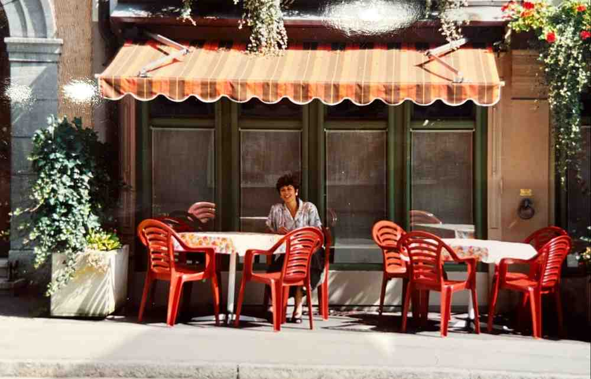

+++
title = "Vom Rheinfall an den Wohlensee"
date = "2024-03-15"
draft = false
pinned = false
tags = ["Restaurant"]
image = "6180c4cc-0ab9-42fc-9f0e-268ce670f314.jpeg"
description = "Gabi Corra wechselte von der Selbständigkeit in die Unselbständigkeit und fühlt sich dabei viel freier "
footnotes = ""
+++
### **Beschreiben sie das Restaurant das sie geführt haben.**

Das Restaurant, das ich von meinen Eltern übernommen habe, war ein beliebter Treffpunkt mit einer breiten Stammkundschaft. Wir spezialisierten uns auf Holzofen-Pizzas und servierten auch andere warme Gerichte aus dem Ofen. Unsere Öffnungszeiten begannen um halb neun morgens, und wir zogen eine vielfältige Kundschaft an. Vormittags kamen vor allem Berufstätige, die sich in unserem gemütlichen Ambiente trafen, Geschäfte machten und einen Kaffee tranken. Über Mittag waren wir beliebt bei Mitarbeitern der nahegelegenen Industrie. Die Nachmittage waren etwas ruhiger, aber am Abend füllte sich das Restaurant erneut mit einer vielfältigen Mischung von Gästen, darunter Vereine, Arbeiter und Firmendirektoren. Mit 70 Sitzplätzen waren wir oft zweimal am Abend besetzt, mit Gästen, die von 18 bis 20 Uhr und dann von 20 bis 22 Uhr blieben. Die Küche schloss um halb elf, sodass die Gäste bis zum späten Abend essen konnten.

### **Was waren die Herausforderungen?**

Die Herausforderungen bestanden hauptsächlich darin, qualifizierte Mitarbeiter zu finden und mit den Behörden zusammenzuarbeiten, insbesondere mit der Lebensmittelkontrolle, die unangekündigt auftauchte, um die Sauberkeit und Hygiene zu überprüfen. Glücklicherweise gab es selten Probleme in diesem Bereich. Die grösste Herausforderung lag jedoch in der Mitarbeiterführung, insbesondere bei Saisonkräften und ausländischen Arbeitskräften, die über Arbeitsvermittlungsbüros angestellt wurden. Die Sprachbarriere und unterschiedliche Arbeitsmoral machten die Zusammenarbeit nicht immer einfach.

### **Was war auf der Speisekarte?**

Auf unserer Speisekarte fanden sich hauptsächlich Pizzas, verschiedene Fleischgerichte und Teigwarengerichte wie Lasagne und Cannelloni. Doch unsere hauseigene Spezialität war das legendäre Cicci. Die Geschichte des Cicci ist einzigartig: Eine Gruppe von Frauen kam und wünschte sich Schnecken zu essen, die normalerweise in einer Kokotte serviert werden. Eine Dame in der Gruppe hatte jedoch Bedenken. Mein Vater, der damals das Geschäft leitete, versicherte ihr, dass sie etwas Besonderes zubereiten würden, und schlug vor, kleine Fleischstücke in die Kokotte zu geben. Gesagt, getan – so entstand das Cicci. Der Name stammt aus unserem italienischen Dialekt, in dem ein grosses Stück Fleisch "Ciccia" genannt wird, und "Cicci" ist die Verkleinerungsform.

### **Weshalb wurde das Restaurant verkauft?**

Nach 25 Jahren Selbstständigkeit und aus persönlichen Gründen habe ich mich dazu entschlossen, das Restaurant zu verkaufen. Dabei empfand ich einerseits Erleichterung, da ich nicht mehr die volle Verantwortung für die Angestellten tragen musste und nicht mehr ständig darauf achten musste, dass das Geschäft reibungslos lief und genügend Kunden da waren. Dies war eine Befreiung für mich. Allerdings war es gleichzeitig auch schwierig, mich von den treuen Kunden zu verabschieden. Über die Jahre hatte sich eine enge Beziehung zu vielen von ihnen entwickelt, einige sind mir regelrecht ans Herz gewachsen und wurden fast wie Freunde. Da ich eine grosse Stammkundschaft hatte, vermisse ich sie natürlich schon jetzt. Es war also eine Mischung aus Erleichterung und Wehmut beim Verkauf des Restaurants.

### **Umzug nach Bern, was ist anders?**

Ja, ich bin der Liebe wegen von Neuhausen nach Wohlen bei Bern gezogen. Der Hauptunterschied zwischen den beiden Orten liegt in ihrer Grösse und Atmosphäre. Neuhausen ist ein kleiner Ort, in dem es sehr familiär zugeht und jeder jeden kennt, während Bern grösser und anonymer ist. In Wohlen gefällt mir besonders gut, dass wir ein schönes Zuhause haben und eine wunderbare Familie, die mich herzlich aufgenommen hat. Es ist einfach schön hier.

### **Was vermisst du von Neuhausen?**

Von Neuhausen vermisse ich natürlich meine Familie Corra, die noch dort lebt, sowie meine Schulkameraden und die engen Beziehungen zu den Gästen meines Restaurants, die ich über die Jahre aufgebaut habe. Ausserdem vermisse ich das beruhigende Rauschen des Rheinfalls. Auch die familiäre Atmosphäre von Neuhausen, wo man sich auf der Strasse kennt und gerne mal stehen bleibt, um einen Schwatz zu führen, fehlt mir.

***"Man muss Kunden mögen"***

### **Neue Arbeit in Bern.**

Nachdem ich wieder arbeiten wollte, habe ich eine Stelle im Verkauf in einem Delikatessengeschäft namens "Vom Fass" in der Stadt Bern gefunden. Dort haben wir eine Vielzahl von Ölen, Essigen und anderen Spezialitäten angeboten, die die Kunden entweder in mitgebrachte Flaschen abfüllen konnten oder in Flaschen, die wir vor Ort bereitgestellt haben. Zusätzlich zu den Ölen und Essigen führten wir auch diverse Alkoholika wie Whiskys, Grappas und verschiedene Weine. Meine Erfahrung als ehemalige Wirtin kam mir dabei natürlich zugute, besonders im Umgang mit Kunden und beim Verkauf von Spezialitäten.

### **Worin unterscheidet sich das Wirten vom Verkaufen und wo gibt es Gemeinsamkeiten?**

Die grössten Gemeinsamkeiten zwischen den Berufen als Wirtin und Verkäuferin liegen darin, dass beide viel mit Kunden zu tun haben. Man muss Kunden mögen. Diese Fähigkeit war auch im Verkauf sehr wichtig für mich.

Der Hauptunterschied liegt in den Arbeitszeiten. Als Verkäuferin endet die Arbeit normalerweise um 19 Uhr, während im Gastgewerbe oft bis Mitternacht gearbeitet wird. Als selbstständige Wirtin hatte ich praktisch keine Freizeit, da ich nach Feierabend noch die Abrechnung, Einkäufe und Büroarbeit erledigen musste. Als Angestellte im Verkauf konnte ich nach Feierabend einfach nach Hause gehen und musste mich um nichts mehr kümmern.

***"Als Angestellte ist man viel freier"***

Zusammenfassend lässt sich sagen, dass die Gemeinsamkeiten zwischen den Berufen im Umgang mit Kunden liegen, während die grössten Unterschiede in den Arbeitszeiten und der Freizeitgestaltung zu finden sind.

### **Worin bestanden die grössten Veränderungen**

Die grösste Veränderung für mich bestand einerseits im Umzug von meiner vertrauten Umgebung nach Bern. Andererseits war es auch der Übergang von der Selbstständigkeit zur Unselbstständigkeit, wobei diese Veränderung auch positive Seiten mit sich brachte. Ich trug keine Verantwortung mehr und hatte keine Probleme mehr mit Behörden oder mit dem Personal.

### **Würdest du heute etwas anders machen?**

Wenn ich heute auf meine Zeit im Gastgewerbe zurückblicke, würde ich wahrscheinlich eine Ausbildung im Gastgewerbe absolvieren, um eine bessere Grundlage für meine Arbeit zu haben. Als ausgebildete Köchin hätte ich dann möglicherweise mehr Möglichkeiten gehabt.

### Zur Person

Gabi Corra (1959) ist in Neuhausen am Rheinfall aufgewachsen. Nach einer Ausbildung zur Handarbeitslehrerin hat sie mit 23 Jahren das elterliche Restaurant Rebstock übernommen. Fast 25 Jahre später ist sie ihrem Herzen gefolgt und nach Wohlen bei Bern gezogen. Sie hat das Wirten aufgegeben und eine Stelle als Verkäuferin angetreten.